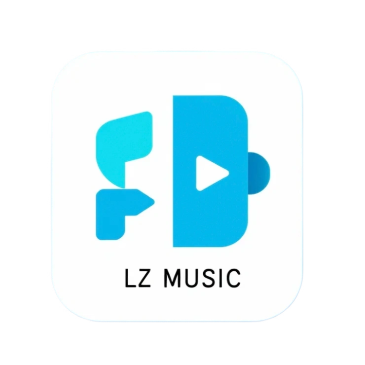

# LZ Music

<div align="center">
  

  ### 全新2.0重制版

[](https://github.com/yan5236/lzmusic/releases)
[](LICENSE)
[](https://github.com/yan5236/lzmusic/releases)

[](https://github.com/yan5236/lzmusic/releases)
[](https://github.com/yan5236/lzmusic/releases)
[](https://github.com/yan5236/lzmusic/releases)

[](package.json)
[](package.json)
[](package.json)
[](https://deepwiki.com/yan5236/lzmusic)
[![zread](https://img.shields.io/badge/Ask_Zread-_.svg?style=flat&color=00b0aa&labelColor=000000&logo=data%3Aimage%2Fsvg%2Bxml%3Bbase64%2CPHN2ZyB3aWR0aD0iMTYiIGhlaWdodD0iMTYiIHZpZXdCb3g9IjAgMCAxNiAxNiIgZmlsbD0ibm9uZSIgeG1sbnM9Imh0dHA6Ly93d3cudzMub3JnLzIwMDAvc3ZnIj4KPHBhdGggZD0iTTQuOTYxNTYgMS42MDAxSDIuMjQxNTZDMS44ODgxIDEuNjAwMSAxLjYwMTU2IDEuODg2NjQgMS42MDE1NiAyLjI0MDFWNC45NjAxQzEuNjAxNTYgNS4zMTM1NiAxLjg4ODEgNS42MDAxIDIuMjQxNTYgNS42MDAxSDQuOTYxNTZDNS4zMTUwMiA1LjYwMDEgNS42MDE1NiA1LjMxMzU2IDUuNjAxNTYgNC45NjAxVjIuMjQwMUM1LjYwMTU2IDEuODg2NjQgNS4zMTUwMiAxLjYwMDEgNC45NjE1NiAxLjYwMDFaIiBmaWxsPSIjZmZmIi8%2BCjxwYXRoIGQ9Ik00Ljk2MTU2IDEwLjM5OTlIMi4yNDE1NkMxLjg4ODEgMTAuMzk5OSAxLjYwMTU2IDEwLjY4NjQgMS42MDE1NiAxMS4wMzk5VjEzLjc1OTlDMS42MDE1NiAxNC4xMTM0IDEuODg4MSAxNC4zOTk5IDIuMjQxNTYgMTQuMzk5OUg0Ljk2MTU2QzUuMzE1MDIgMTQuMzk5OSA1LjYwMTU2IDE0LjExMzQgNS42MDE1NiAxMy43NTk5VjExLjAzOTlDNS42MDE1NiAxMC42ODY0IDUuMzE1MDIgMTAuMzk5OSA0Ljk2MTU2IDEwLjM5OTlaIiBmaWxsPSIjZmZmIi8%2BCjxwYXRoIGQ9Ik0xMy43NTg0IDEuNjAwMUgxMS4wMzg0QzEwLjY4NSAxLjYwMDEgMTAuMzk4NCAxLjg4NjY0IDEwLjM5ODQgMi4yNDAxVjQuOTYwMUMxMC4zOTg0IDUuMzEzNTYgMTAuNjg1IDUuNjAwMSAxMS4wMzg0IDUuNjAwMUgxMy43NTg0QzE0LjExMTkgNS42MDAxIDE0LjM5ODQgNS4zMTM1NiAxNC4zOTg0IDQuOTYwMVYyLjI0MDFDMTQuMzk4NCAxLjg4NjY0IDE0LjExMTkgMS42MDAxIDEzLjc1ODQgMS42MDAxWiIgZmlsbD0iI2ZmZiIvPgo8cGF0aCBkPSJNNCAxMkwxMiA0TDQgMTJaIiBmaWxsPSIjZmZmIi8%2BCjxwYXRoIGQ9Ik00IDEyTDEyIDQiIHN0cm9rZT0iI2ZmZiIgc3Ryb2tlLXdpZHRoPSIxLjUiIHN0cm9rZS1saW5lY2FwPSJyb3VuZCIvPgo8L3N2Zz4K&logoColor=ffffff)](https://zread.ai/yan5236/lzmusic)

  <div>
    <a href="https://github.com/yan5236/lzmusic/releases">下载</a> ·
    <a href="https://github.com/yan5236/lzmusic/issues">问题反馈</a> ·
    <a href="#使用指南">使用指南</a>
  </div>
</div>

---

### 警告⚠️：由于[bilibili-API-collect](https://github.com/SocialSisterYi/bilibili-API-collect)被发了律师函，而此项目使用了该仓库，因此今天起将暂停更新，手机端也将不再开发，感谢各位的支持，我们在下个项目有缘再见。

—— 项目维护者，2026年2月3日

## 项目介绍

LZ Music 是一款基于 Electron + React + TypeScript 开发的桌面音乐播放器。支持 Bilibili 的音乐播放，具有本地音乐管理、播放列表管理、歌词显示等功能。

> ⚠️ **使用前请阅读**：[使用前须知](./使用前须知.md)

## 软件截图

<div align="center">
  
</div>

## 核心功能

- 🎵 音乐支持：Bilibili
- 📁 本地音乐管理：支持导入本地音乐库
- 📝 歌词显示：在线歌词 + 本地歌词
- 📋 播放列表管理：创建、编辑、排序播放列表
- 🎨 主题切换：支持亮色/暗色主题（暗色下一版上线）
- 🔍 智能搜索：搜索历史记录
- 🎯 自定义播放模式：循环、随机、单曲循环

## 技术栈

### 前端
- **React 19** - 用户界面框架
- **TypeScript** - 类型安全
- **Vite** - 构建工具
- **Tailwind CSS** - 样式框架
- **Material-UI** - UI 组件库
- **@dnd-kit** - 拖拽排序

### 后端
- **Electron 40** - 桌面应用框架
- **better-sqlite3** - 本地数据库

## 项目结构

```
lzmusic/
├── src/
│   ├── electron/          # Electron 主进程代码
│   │   ├── api/           # IPC API 处理器
│   │   ├── database/      # 数据库模块
│   │   ├── ipc/           # IPC 通信
│   │   ├── protocols/     # 自定义协议
│   │   └── windows/       # 窗口管理
│   ├── ui/                # React UI 代码
│   │   ├── components/    # 可复用组件
│   │   ├── views/         # 页面组件
│   │   ├── hooks/         # 自定义 Hooks
│   │   └── utils/         # UI 工具函数
│   └── shared/            # 共享类型和工具
├── public/                # 静态资源
├── assets/                # 应用图标等资源
└── package.json
```

## 使用的开源项目

本项目在开发过程中使用了以下优秀的开源项目：

### API 相关
- [Bilibili API](https://github.com/SocialSisterYi/bilibili-API-collect) - Bilibili 开放 API 文档，被发律师函，已停更
- [NeteaseCloudMusicApi - 已删库](https://github.com/Binaryify/NeteaseCloudMusicApi) - 网易云音乐 API（原仓库已删除）

### 核心依赖
- [Electron](https://www.electronjs.org/) - 跨平台桌面应用框架
- [React](https://react.dev/) - UI 框架
- [Vite](https://vitejs.dev/) - 下一代前端构建工具
- [Tailwind CSS](https://tailwindcss.com/) - 原子化 CSS 框架
- [better-sqlite3](https://github.com/WiseLibs/better-sqlite3) - 快速的 SQLite3 同步封装

## 安装与运行

### 环境要求
- Node.js >= 18.0.0
- npm >= 9.0.0

### 开发环境
```bash
# 安装依赖
npm install

# 编译 better-sqlite3 模块
npm run rebuild

# 启动开发服务器
npm run dev

# 仅启动 React 开发服务器
npm run dev:react

# 构建并运行生产版本
npm run dev:dist
```

### 构建与打包
```bash
# 构建 React UI 和 Electron 主进程
npm run build

# 打包生成安装包
npm run dist          # 当前平台
npm run dist:win      # Windows
npm run dist:mac      # macOS
npm run dist:linux    # Linux
```

### 代码检查
```bash
# 运行 ESLint 检查
npm run lint
```

## 使用指南

### 导入音乐
- 点击左侧边栏的"本地音乐"
- 点击导入按钮选择音乐文件夹
- 等待扫描完成

### 创建播放列表
- 在"我的歌单"页面点击"创建歌单"
- 输入歌单名称并确认
- 从搜索结果或本地音乐添加歌曲

### 歌词设置
- 在播放器底部点击歌词按钮
- 可调整歌词字体大小和显示模式

## 开发说明

- 使用 `npm run lint` 检查代码规范
- 遵循项目现有的代码风格
- 使用 TypeScript 严格模式
- IPC 通信使用结构化响应对象

## 许可证

[GPL-3.0](LICENSE)

## 贡献

欢迎提交 Issue 和 Pull Request！

---

<div align="center">
  <sub>由 ❤️ 和 ☕ 驱动</sub>
</div>
